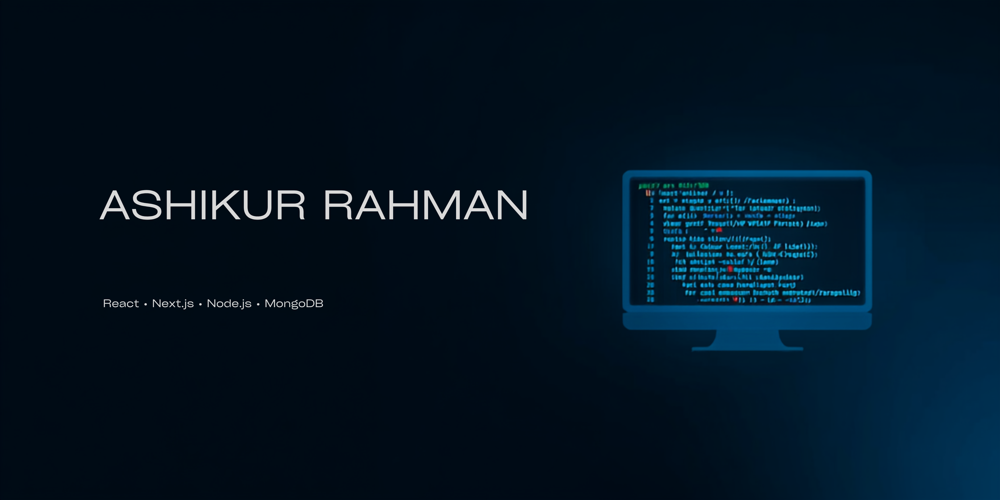

  

<h1 align="center">Hi 👋, I'm Ashikur Rahman</h1>

<h3 align="center">
Computer Science Student | Full Stack Web Developer | Next.js Enthusiast
</h3>

Passionate about building modern web applications with clean UI, scalable backend architecture, and real-world problem solving.

---

# 💫 About Me

I'm a Computer Science student passionate about building modern and user-friendly web applications. I enjoy learning new technologies, solving challenging problems, and turning ideas into real products. Currently, I'm focusing on mastering full-stack development with the latest JavaScript ecosystem while continuously improving my problem-solving skills.

---

# 🚀 Current Activities

- 🌱 Exploring **Next.js**
- 💻 Building a **Tourism Website**
- 📚 Solving **LeetCode** problems every day
- 🔥 Learning **System Design & Backend Development**
- ⚡ Improving my **DSA** skills

---

# 💻 Tech Stack

## 🎨 Frontend

---

## ⚙️ Backend

---

## 🗄️ Database

---

## 🛠️ Tools

---

## 📖 Currently Learning

---

# 🌐 Connect with Me

---

# 📊 GitHub Stats

---

# 🔥 GitHub Streak

---

# 🏆 GitHub Trophies

---

# 📈 Contribution Graph

  

---

# 💡 Favorite Quote

> *"First, solve the problem. Then, write the code."* — John Johnson

---

